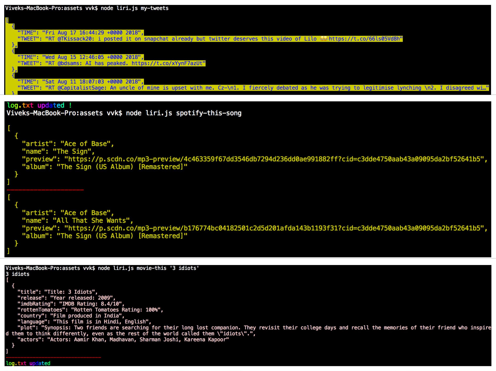

# liri-node-app

This project uses Node.js and JavaScript to create a command line app that functions as limited version of Apple's Siri. The app accesses Twitter, Spotify and OMBD through their APIs to receive different levels of information. The Twitter API provides 20 of the user's most recent tweets. The Spotify API allows the user to search for a song by title or title and band name; it provides multiple responses. OMBD provides selected information about the title of the film searched. __There is no user interface for this application, it is recommend you either fork the code to your own system__

## Getting Started

Twitter and Spotify require any potential users to provide their own .env file with keys to the different APIs. OMBD has an access key built into the code but it would work more reliably if you provided your personal key. Default searches are provided for both OMBD and Spotify.

## App Screenshot

##Prerequisites

* Dotenv
    * npm i dotenv
    [Instructions for Dotenv](https://www.npmjs.com/package/dotenv)
* Chalk
    * npm i chalk
    [Instructions for Chalk](https://www.npmjs.com/package/chalk)
* Chalk Animation
    * npm i chalk-animation
    [Instructions for Chalk Animation](https://www.npmjs.com/package/chalk-animation)
* Twitter
    * npm i twitter
    [Instructions for Twitter](https://www.npmjs.com/package/twitter)
* Spotify
    * npm i node-spotify-api
    [Instructions for Spotify](https://www.npmjs.com/package/node-spotify-api)
* Request
    * npm i request
    [Instructions for Request](https://www.npmjs.com/package/request)
* OMBD API
    [OMBD API Page](http://www.omdbapi.com/)

##How to Obtain Keys

* Link to Twitter API
    * [Twitter](https://dev.twitter.com/)

* Link to Spotify API
    * [Spotify](https://beta.developer.spotify.com/documentation/web-api/)

## Running Tests

The following commands are used in the command line:

* my-tweets
* spotify-this-song
* movie-this
* do-what-it-says

How to use each command in the command line: 

* Twitter 
    * node liri.js my-tweets

* Spotify 
    * node liri.js spotify-this-song 'title of song'

* OMDB 
    * node liri.js movie-this 'title of film'

* Do What It Says
    * node do-what-it-says
    * This command relies on the text in random.txt to receive a command. The text runs one of the three previous commands. Example in random.txt :
    spotify-this-song,"I want it that way"

## Authors

* [Vivek Malhan](https://docvvk.github.io/Portfolio/)
